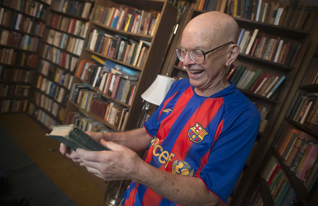

```{r setup, include=FALSE}
options(htmltools.dir.version = TRUE)
knitr::opts_chunk$set(
  echo = TRUE,
  cache = FALSE,
  warning = FALSE,
  error = FALSE,
  message = FALSE
)
htmltools::tagList(rmarkdown::html_dependency_font_awesome())
```
class: inverse, center, middle

#  Programar para disfutar de las matemáticas

---
class: center
## La conjetura de Gilbreath


---
class: center
## Esto es un armonógrafo

---
class: center
## Sirve para dibujar

---
class: center
## Pero no hay por qué complicarse tanto la vida

---
class: center
## Pero no hay por qué complicarse tanto la vida

---
class: center
## Pero no hay por qué complicarse tanto la vida

---
class: center
## Pero no hay por qué complicarse tanto la vida

---
class: center
## Pero no hay por qué complicarse tanto la vida

---
class: center
## Pero no hay por qué complicarse tanto la vida

---
class: center
## La paradoja de Parrondo
### ¿Jugarías a este juego?

---
class: center
### 100 partidas de 5.000 tiradas con 100&euro; de salida

---
class: center
## La paradoja de Parrondo
### ¿Y a este?

---
class: center
### 100 partidas de 5.000 tiradas con 100&euro; de salida

---
class: center, middle
# ¿Y si combinaras al azar el primer juego y el segundo?
---
class: center
### 100 partidas de 5.000 tiradas con 100&euro; de salida

---
class: inverse, center, middle

#  Programar para trabajar


---
class: center
.left-column[
## Ejemplos
### - Coca Cola

]
.right-column[

### Coca-Cola utiliza un algoritmo llamado [Black Book](https://www.bloomberg.com/news/articles/2013-01-31/coke-engineers-its-orange-juice-with-an-algorithm) para **asegurar que su zumo de naranja tiene un sabor consistente siempre**. 
### El algoritmo incorpora **imágenes por satélite**, **rendimiento de los cultivos** y **preferencias de los consumidores** para determinar la mezcla ideal

]

---
class: center
.left-column[
## Ejemplos
### - Coca Cola
### - Movistar
]

.right-column[

### Para Movistar es muy importante ayudar a sus clientes a **descubrir películas nuevas**: esto hace que valoren mejor la televisión 
### La recomendación se realiza gracias a algoritmos llamados ** *filtros colaborativos* **, que analizan qué han visto otras personas parecidas a tí e involucran **potentes cálculos matriciales**
]


---
class: center
.left-column[
## Ejemplos
### - Coca Cola
### - Movistar
### - Shazam
]
.right-column[


### Shazam es conocida por su **capacidad de reconocer canciones a partir de una pequeña muestra** mediante algoritmos propios
### Si encuentra un *match*, envía información del **artista**, **título** de la canción y del album, así como **links** a iTunes, YouTube, Spotify or Zune

]

---

class: inverse, center, middle

#  Vamos a programar un poquito


---
## Vectores, bucles, gráficos básicos y data frames
```{r,fig.width=8,fig.height=4,fig.align='center',eval=FALSE}
n=100
fibo=c()
fibo[1]=1
fibo[2]=fibo[1]
for (i in 3:n) fibo[i]=fibo[i-1]+fibo[i-2]
plot(fibo, type="l")
#cociente
fiboc=c(1)
for (i in 2:n) fiboc[i]=fibo[i]/fibo[i-1]
plot(fiboc, type="l")
#Crear un data frame
fibonaccidf=data.frame(fibo=fibo, ficoc=fiboc)
#Crear una variable nueva en el data frame
fibonaccidf$first=substr(fibo,1,1)
#Ver de que tipo es
str(fibonaccidf)
#Cambiar el tipo
fibonaccidf$first=as.numeric(fibonaccidf$first)
#Ver de que tipo es
str(fibonaccidf)
```
---
## El paquete dplyr, funciones, gráficos avanzados
```{r,fig.width=8,fig.height=4,fig.align='center',eval=FALSE}
#Sacar conteos
library(dplyr)
fibonaccidf %>% 
  group_by(first) %>% summarize(casos=n()) %>% 
  arrange(first)-> fibonacci_stats
#Funciones en R
benford=function(x) {log10(1+1/x)}
benford(1)
#Pintar una funcion en R sin datos
library(ggplot2)
ggplot(data.frame(x=c(1:9)), aes(x)) + stat_function(fun=benford)
#Valores de la funcion en 1:9
benford(1:9)
#suma de esos valores
sum(benford(1:9))
fibonacci_stats$expected=benford(fibonacci_stats$first)
total_casos=sum(fibonacci_stats$casos)
fibonacci_stats$observed=fibonacci_stats$casos/total_casos
```
---

## Ahora tú

###Calcula el Error Cuadrático Medio (ECM) del ajuste de Benford
$$ECM=\frac{1}{n}\sum_{i=1}^n(Y_i-\hat{Y}_i)^2$$
###¿Cuál es el ECM para n=200?

---

class: inverse, center, middle

#  La Enciclopedia On Line de las Sucesiones de Números Enteros (OEIS)


---
.left-column[
## La OEIS
### - Qué es
]
.right-column[
Es una **enorme base de datos** donde buscar sucesiones de números enteros. Sitio web: [www.oeis.org](www.oeis.org)
]
--
.right-column[
A ella recurren personas de todo el mundo para investigar en disciplinas como **teoría de números**, **teoría de juegos**, **rompecabezas**, **física**, **química**, **comunicaciones** ...
]
--
.right-column[
Se nutre de sucesiones que proponen **personas** ***normales y corrientes***, y cada año incorpora aproximadamente **10.000 nuevas entradas**
]

--
.right-column[
Actualmente contiene **mas de 285.000 sucesiones** de una variedad increíble. Dos ejemplos:
<style>
.listado li{
  margin:7px 0;
}
</style>

.listado[
* Número de maneras distintas de atarse un zapato con `n` pares de ojales
* Por supuesto, **la sucesión de Fibonacci**
]
]
---
.left-column[
## La OEIS
### - Qué es
### - Neil Sloane
]
.right-column[
Es un **matemático estadounidense** (es el señor de la camiseta del Barsa)
]
--
.right-column[
Comenzó a recopilar sucesiones de enteros en 1963 y **creó la OEIS en 1996**
]
--
.right-column[
Considerado **uno de los matemáticos mas influyentes de la actualidad**
]
--
.right-column[
¡Un día **me escribió un correo electrónico a mí**!<sup>*</sup>
.footnote[
<sup>*</sup> Para decirme que creía una cosa que yo había publicado estaba mal
]
]
---
.left-column[
## La OEIS
### - Qué es
### - Neil Sloane
### - La favorita de Neil
]
.right-column[
Es **esta**:
> 0, 0, 1, 0, 2, 0, 2, 2, 1, 6, 0, 5, 0, 2, 6, 5, 4, 0, 5, &#46;&#46;&#46;

Se crea con esta **regla**:
>empieza con 0, y si llegas a un nº que no has visto antes, **el siguiente término es 0** pero si ya ha aparecido previamente, cuentas el **nº de términos desde su última aparición**, y ese nº es el siguiente término

Así pues:

<style>
.listado li{
  margin:7px 0;
}
</style>

.listado[
* El primer término es 0 por definición
* Como no hemos visto ningún 0 antes, el segundo término es también 0
* Como hemos visto un 0 antes, un paso atrás, el tercer término es 1
* Como no hemos visto ningún 1 antes, el cuarto término es 0
* Como hemos visto un 0 antes, dos pasos atrás, el quinto término es 2
* ...
]
]
---
.left-column[
## La OEIS
### - Qué es
### - Neil Sloane
### - La favorita de Neil
### - Proponer una sucesión
]
.right-column[
**Piensa**, **piensa** y **piensa**
]
--
.right-column[
**Comprueba que tu sucesión no existe** ya introduciendo los primeros términos en la cajita de [búsqueda](http://oeis.org/) de la página principal de la OEIS
  * Si existe **no te desesperes** y vuelve al paso anterior
]
--
.right-column[
Si crees que no existe, [regístrate](https://oeis.org/login?redirect=/edit/new) y rellena el formulario para proponer una nueva sucesión
  La revisará algún matemático del mundo y **te contestará en poco tiempo**
]
--
.right-column[
Si te la aceptan, entre otras cosas * **podrás escuchar cómo suena** *
]
---
.left-column[
## La OEIS
### - Qué es
### - Neil Sloane
### - La favorita de Neil
### - Proponer una sucesión
### - La mía
]
.right-column[
Se llama [**A276643**](https://oeis.org/A276643) y es **esta**:
> 1, 4, 10, 20, 35, 56, 84, 120, 165, 220, 282, 348, &#46;&#46;&#46;

Se crea con esta **regla**:
>El n-ésimo término es la cantidad de **matrículas de coche distintas** de 4 dígitos que suman n, con n=0, 1, 2, ..., 36

Es la segunda que propongo: **la primera me la rechazaron**

La generé **con este código de R**:
```{r,fig.width=8,fig.height=4,fig.align='center'}
library(dplyr)
data=expand.grid(0:9, 0:9, 0:9, 0:9)
data %>% mutate(n=Var1+Var2+Var3+Var4) %>% 
  group_by(n) %>% 
  summarise(value=n()) -> suc
```

]

---

class: inverse, center, middle

#  Vamos a aprender algo mas complicado


---
class: center
#  Pero, ¿por qué?

&nbsp; 
--

###Porque quiero que veais **que está a vuestro alcance**

--
###Porque con R se aprenden también otros lenguajes ** *de regalo* **

--
###Porque **los mapas molan**

---
class: center
#La vista es lo primero
###Los gráficos son **una parte importante de cualquier trabajo**
###R es una herramienta extraordinaria para hacer gráficos, desde los mas **sencillos**, para explorar datos hasta los mas **complejos**, para presentar conclusiones de manera profesional
###Los gráficos interactivos son estupendos para esto pero **siempre han estado al alcance de unos pocos**: los programadores de JavaScript
###R hace muy fácil la creación de gráficos JavaScript **sin necesidad de saber JavaScript**
###**Vamos a hacer unos mapas interactivos**

---
##¿Dónde estamos hoy?
```{r,fig.width=6,fig.height=3,fig.align='center'}
library(ggmap)
geocode("Plaza de las Ciencias, Universidad Complutense, Madrid")
library(leaflet)
leaflet() %>% addProviderTiles(providers$CartoDB.Positron) %>%
  addMarkers(lng=-3.725825, lat=40.44931, popup="ESTALMAT Madrid")
```
---
## Ahora tú

### Vamos a pintar cada un mapa **con los cinco lugares de la tierra** a los que nos gustaría viajar
### Pasos:
  + Haz un **vector** con los nombres de los cinco sitios
  + Pásale la función **geocode**
  + Haz un **data frame** con todo lo anterior
    + Tiene que tener 3 columnas: nombre, longitud y latitud
  + Píntalo con `leaflet` (aquí os ayudo yo)
---
## Mi programa
```{r, eval=FALSE}
sitios=c("Venecia, Italia",
         "Petra, Jordania",
         "Taj Mahal, India",
         "Nueva York, EEUU",
         "Peking, China")

library(ggmap)
geocode(sitios)->coordenadas
data.frame(sitios, coordenadas) -> datos

library(leaflet)
leaflet(datos) %>%
  addProviderTiles("NASAGIBS.ViirsEarthAtNight2012") %>%
  addMarkers(lng = ~lon, 
             lat = ~lat, 
             popup = ~sitios) -> mi_mapa

```
.footnote[
<sup>*</sup> El gusanillo se escribe Alt+126]
---
## Mi mapa (NASA style)

```{r, fig.width=10,fig.height=6,fig.align='center', echo=FALSE}
library(leaflet)
data.frame(
sitios=c("Venecia, Italia",
         "Petra, Jordania",
         "Tah Mahal, India",
         "Nueva York, EEUU",
         "Peking, China"),
lon=c(12.31552, 35.44436, 78.04216, -74.00594, 116.40740),
lat=c(45.44085, 30.32845, 27.17502, 40.71278, 39.90420)) %>% 
leaflet() %>%
  addProviderTiles("NASAGIBS.ViirsEarthAtNight2012") %>%
  addMarkers(lng = ~lon, 
             lat = ~lat, 
             popup = ~sitios)
```
---
##Para terminar
* Puedes elegir el mapa de fondo que mas te guste [aquí](http://leaflet-extras.github.io/leaflet-providers/preview/index.html)
* Puedes guardar tu mapa en el ordenador así
```{r, eval=FALSE}
library(htmlwidgets)
saveWidget(mi_mapa, "mi_mapa.html")
```
* Te recomiendo que le eches un vistazo a la página de [Leaflet for R](https://rstudio.github.io/leaflet/)

---
## Conclusiones

+ Programar te permite **ver las cosas con tus propios ojos**

--

+ Además es una **habilidad cada vez mas cotizada por las empresas**

--

+ Aprender R **es una buena inversión** (*solo* de tiempo)
  * Leed [R for Beginners](https://cran.r-project.org/doc/contrib/Paradis-rdebuts_en.pdf)

--

+ Una forma *chula* de practicar R y de pasar un poquito a la historia de las matemáticas es **proponer una sucesión a la OEIS **

--

+ **Contad conmigo para lo que queráis**
  * **email:** `aschinchon@gmail.com`

--

+ El código de todos los experimentos que hemos visto (y muchos mas) está en [www.fronkonstin.com](www.fronkonstin.com)

---
class: center, middle, inverse
# ¡Misión cumplida!


<style>
.footnote{
  width: 100%;
  text-align: left;
}
.footnote a{
  color: inherit;
  text-decoration: inherit;
}
</style>

.footnote[
Antonio Sánchez Chinchón    

<a href="https://github.com/aschinchon"><i class="fa fa-github"></i></a>
&nbsp;&nbsp;
<a href="https://www.linkedin.com/in/aschinchon/"><i class="fa fa-linkedin"></i></a>
&nbsp;&nbsp;
<a href="https://twitter.com/aschinchon"><i class="fa fa-twitter">@aschinchon</i></a>
]

